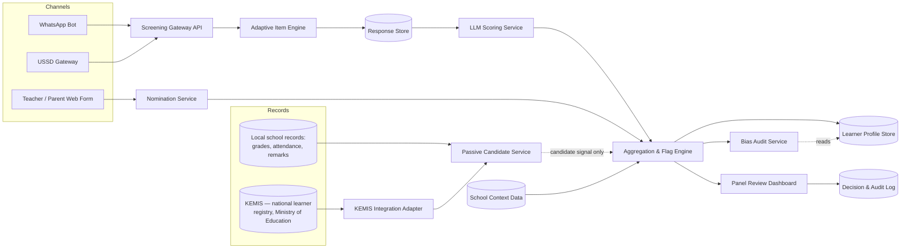

# Kuza Connect — System Specification
**v0.1 draft — for engineering alignment, not yet costed or approved**

---

## 1. The problem

There is no formal mechanism for identifying gifted learners in Kenyan public or informal-settlement schools. The children furthest from the existing (weak) system are the ones it misses hardest:

- **No identification infrastructure.** School and learner records live in fragmented systems — KNEC data, and increasingly KEMIS, the Ministry of Education's new centralized learner registry (kemis.go.ke, consolidating NEMIS/TVET-MIS/HEMIS, reported live from January 2026) — none of which were built for identification, and none of which we have a data-sharing agreement for. Building the pilot's critical path on access we don't yet have is a risk we're explicitly avoiding; see Section 4 for how a future integration is scoped to not block anything.
- **Teacher nomination is biased toward compliance, not potential.** Quiet, disruptive, or under-resourced kids are systematically passed over.
- **Some children are invisible to every active channel.** A child who's never disruptive enough to get nominated, never takes a screening session because it never reaches them, or whose guardian never returns a consent form, simply doesn't exist in the system — even though the school already holds data (grades, attendance, remarks) that could have surfaced them without requiring the child to do anything at all.
- **Timed, single-score tests actively hide the population we most want to find.** Twice-exceptional (2e) learners — gifted *plus* ADHD, autism, or dyslexia — read as "average" or "problem child" on every conventional signal, because the disability masks the giftedness and the giftedness masks the disability. This isn't a fringe edge case; it's a documented, named population in the Kenyan context (see Kanga, 2024, on twice-exceptional education in Kenya).
- **Diagnosis is not available at scale.** Kenya has near-zero formal diagnostic capacity outside private Nairobi clinics. Any system that requires a diagnosis to accommodate a child will simply never reach the population it's meant for.
- **Data protection is a real constraint, not a compliance afterthought.** Kenya's DPA 2019 makes health data a liability to collect. A system that needs diagnostic labels to function is both practically unworkable and legally risky.

**The population this is built for:** children in informal settlements (pilot: Kibera and Mukuru), screened through an existing schooling network (60 APBET schools via the M.A.T.H network), with deliberate design attention to twice-exceptional learners specifically.

---

## 2. The solution

Kuza Connect finds gifted children by measuring **learning velocity and domain-specific reasoning**, not test scores — delivered over channels the target population actually has (WhatsApp, USSD), and scored in a way that surfaces spikes instead of erasing them.

### Three layers, in build order

| # | Layer | What it does | Why it's needed |
|---|-------|--------------|------------------|
| 1 | **Identification engine** | Adaptive screener + structured teacher/parent nomination + context-adjusted, spike-based scoring | This is the core IP. Nothing else works if this doesn't. |
| 2 | **Development programme** | Mentor matching, project spaces, workshops on top of existing content (not a new LMS) | Identification without accommodation is cruel — a 2e child found and then dropped into a neurotypical-designed programme fails publicly. |
| 3 | **Showcase** | Podcast/talent platform turning identified children into visible success stories | Cheapest layer; manufactures proof-of-value that unlocks funding for layers 1–2. |

This spec covers **Layer 1 only** — it's the only layer with real engineering complexity and the only one that needs to exist before a pilot can run.

### Two candidate-generation pathways into Layer 1

| Pathway | Trigger | Data source | Output | Confidence |
|---|---|---|---|---|
| **Active screening** | Child completes the WhatsApp/USSD adaptive session | Live item responses | Domain scores, directly from the child's own answers | High — direct evidence |
| **Nomination** | Teacher or parent submits a structured form | Checklist responses | Amber-flag signal for review | Medium — one human's judgement |
| **Passive record mining** *(new)* | Scheduled batch job over existing school records | Grade/attendance trends, teacher remarks already on file, later: scanned assignments | A candidate signal — a *reason to invite the child to screen*, never a score by itself | Low on its own — always requires corroboration via active screening before anyone advances |

Passive mining doesn't replace active screening — it exists to catch the "never nominated, never screened" gap above. It can generate a candidate; it can never generate a decision. A child surfaced this way still has to go through the same active screener as everyone else before the panel sees anything.

### Who uses it

| Role | Touchpoint |
|---|---|
| Learner | WhatsApp/USSD adaptive screener, in English or Kiswahili |
| Teacher / parent | Structured nomination form (web or WhatsApp), behavioural checklist with 2e amber-flags |
| Panel reviewer | Web dashboard: per-child profile, evidence, recommendation, decision + notes |
| Mentor (Layer 2) | Receives confirmed profiles for matching — out of scope for this spec |
| Donor / partner school | Aggregate, de-identified reporting only — never individual learner data |

---

## 3. The engineering innovation

This is the part that's actually novel, as distinct from "we used AI":

1. **Spike-based scoring architecture, not composite psychometrics.** Standard test scoring collapses multiple domains into one number. This system deliberately never computes that number for decision-making — it scores domains independently and flags on the *maximum* deviation, not the mean. This is a real architectural choice: the aggregation layer has no "composite score" field at all, by design, so it can't quietly get used downstream.
2. **Context-adjusted baselines.** A child's score is evaluated against expected performance *for their school's resource tier*, not a national norm built on well-resourced schools. This is a simple regression, but it's the equity mechanism that makes the whole system defensible, and it means the model needs school-level metadata as a first-class input, not an afterthought.
3. **LLM-based scoring of unstructured, bilingual, child-authored responses.** Open-ended answers ("explain your thinking") are scored by an LLM for reasoning depth and error-pattern type, in English or Kiswahili, from short and often messy text. This is the hardest and most expensive part of the pipeline, and it has to run at a cost low enough to screen thousands of children — this constrains model choice, prompt design, and caching strategy directly.
4. **Low-bandwidth-first delivery.** The primary interface is WhatsApp/USSD, not a native app or web page. This isn't a UI skin decision — it constrains session state management (conversations get interrupted and resumed), and it constrains item design (no rich visual rendering on USSD, so pattern items need to degrade gracefully to text-describable formats).
5. **Privacy-by-architecture, not privacy-by-policy.** The data model has no field anywhere for a diagnosis, a disability label, or a health condition. Accommodation is triggered by response *patterns* (untimed option usage, spike shape), never by a stored label. This is a data-modeling decision as much as a legal one — see Section 5.
6. **AI-as-triage, human-as-decision, with an audit trail.** The scoring service never writes a final decision. It writes a flag and evidence; a human panel writes the decision. Every flag-to-decision path is logged. This matters for both bias defensibility and donor trust — it needs to be true in the schema, not just in the pitch deck.
7. **Retrospective candidate generation from records nobody has to newly produce.** A scheduled job mines data schools already hold — grade trends, attendance, existing free-text teacher remarks — for the same spike signature the active screener looks for (wide variance across subjects, performance that doesn't track attendance, and so on). This is a genuinely different engineering problem from live scoring: it's a batch pipeline over heterogeneous, often incomplete records instead of a clean real-time session, and its output has to be structurally incapable of being mistaken for a score. Two things make it hard: the input is inconsistent across schools (a spreadsheet at one, a paper register at another), and historical teacher remarks carry exactly the nomination bias the rest of this system exists to route around — so this pathway needs its own slice in the bias audit, not a pass because "it's just data."

---

## 4. System architecture



| Service | Responsibility |
|---|---|
| Screening Gateway API | Receives messages from WhatsApp/USSD providers, manages session state, handles interruption/resume |
| Adaptive Item Engine | Selects next item based on running difficulty; owns the item bank |
| Nomination Service | Structured teacher/parent forms, including 2e amber-flag checklist items |
| Passive Candidate Service | Scheduled batch job over existing school records; outputs candidate signals only, never a score, never a decision |
| KEMIS Integration Adapter | Isolates all KEMIS-specific auth, schema, and access-model detail behind one interface, so the rest of the system only ever sees normalized records — not government-portal quirks |
| Response Store | Raw item responses, timestamps, response latency — append-only |
| LLM Scoring Service | Scores each response into a domain + score + evidence text; stateless, horizontally scalable |
| Aggregation & Flag Engine | Applies context adjustment, computes per-domain profile, applies flag rules — never computes a composite score |
| Panel Review Dashboard | Web app for reviewers; shows profile, evidence, recommendation; captures decision |
| Decision & Audit Log | Immutable record of every flag → decision path |
| Bias Audit Service | Scheduled job comparing flag/advance rates across demographic, school-tier, *and pathway* (active/nomination/passive) slices |

**Why an adapter, not a direct integration.** KEMIS is a government system we don't control, with an access model (role-based portal login, per its own FAQ) that predates any relationship with Kuza Connect and could change without notice. The adapter is the only place in the system that knows KEMIS's actual schema and auth mechanism; everywhere else, a KEMIS record and a spreadsheet a partner school emailed over look identical (`SchoolRecordImport`, Section 5). If KEMIS ships a real partner API later, or access turns out to require manual quarterly exports instead, only the adapter changes — nothing downstream does.

---

## 5. Data model (core entities)

Deliberately **no name, no diagnosis, no health field, anywhere** in this model.

```
Learner
  id (pseudonymous, system-generated)
  school_id
  cohort_id
  gender (self/guardian-reported, optional)
  source (active_screening | nomination | passive_signal)
  created_at

School
  id
  name
  tier (resource context, used for score adjustment — not a value judgement)
  network ("APBET / Kibera-Mukuru pilot", etc.)

NominationRecord
  id
  learner_id
  nominator_role (teacher | parent)
  checklist_responses (structured, includes 2e amber-flag items)
  submitted_at

ScreeningSession
  id
  learner_id
  channel (whatsapp | ussd)
  language (en | sw)
  status (in_progress | completed | abandoned)
  started_at / completed_at

ItemResponse
  id
  session_id
  item_id
  raw_response (text or selected option)
  response_time_ms
  created_at

DomainScore
  id
  session_id
  domain
  score (0–100)
  evidence_text
  scoring_model_version
  created_at

ContextAdjustment
  school_id
  domain
  adjustment_factor
  effective_from

FlagEvent
  id
  session_id
  rule_id
  rule_description
  fired_at

PanelReview
  id
  session_id
  reviewer_id
  decision (advance | hold | decline)
  notes
  decided_at

SchoolRecordImport
  id
  school_id
  record_type (grades | attendance | teacher_remarks | assignment_scan)
  source_system (school_local | kemis)
  ingested_at
  raw_reference (pointer to stored file/table — never embedded inline)

CandidateSignal
  id
  learner_id (nullable — a Learner stub may not exist until a signal fires)
  source_import_id
  signal_type (grade_variance | remark_nlp_flag | attendance_discrepancy)
  evidence_text
  confidence (fixed low — structurally cannot outrank an active DomainScore)
  created_at

ConsentRecord
  id
  learner_id
  guardian_identifier (pseudonymous)
  scope (screening | nomination | secondary_use_of_school_records)
  granted_at
```

**DPA 2019 implication:** because there's no health/diagnosis field, this system is meaningfully easier to register and defend than one that stores disability labels. Keep it that way — accommodation logic should always read from `DomainScore` / `FlagEvent` patterns, never from a label field, even if it becomes tempting to add one later for a school partner's convenience. The same discipline applies to passive mining: `CandidateSignal` is a separate table from `DomainScore` on purpose, so a low-confidence historical inference can never be queried or displayed as if it were direct evidence from the child.

---

## 6. Proposed tech stack

Not a final decision — a starting point for engineering to react to.

| Layer | Suggestion | Why |
|---|---|---|
| WhatsApp/USSD integration | Africa's Talking or Twilio | Both have mature Kenya-market USSD support; Africa's Talking has local billing advantages |
| Backend services | Node.js or Python (FastAPI) | Either is fine; pick whatever the founding engineer knows best — this isn't the hard part |
| Primary database | PostgreSQL | Relational integrity matters here (consent, audit trail) more than schema flexibility |
| Scoring service | Claude or GPT API, called statelessly per response | Don't self-host a model for a pilot this size — unit economics favor API calls until volume changes that |
| Session/queue state | Redis (or Postgres if avoiding an extra service for the pilot) | Screening sessions need to survive a dropped connection |
| Panel dashboard | React (internal tool, doesn't need to be pretty, needs to be fast to build) | |
| Hosting | Whatever keeps monthly infra cost negligible during pilot — this should not be the budget line that grows | |
| Assignment OCR *(Phase 2, optional)* | Tesseract or a cloud OCR API | Only worth building once a pilot school actually confirms it can supply scanned exercise books — don't build this speculatively |
| KEMIS integration *(Phase 2+, pending access)* | A dedicated adapter module, not a direct dependency in core services | No public API is documented as of this writing — access is role-based through the government portal. Build the adapter's *interface* early so `SchoolRecordImport` never needs to change shape, but don't build the adapter's *implementation* until an actual data-sharing arrangement with the Ministry of Education exists |

---

## 7. Non-functional requirements

- **Bilingual by default** — English and Kiswahili, not English with a translation bolted on later.
- **Cost per child screened** — target is the headline metric for the pitch; needs a real unit-economics model once the scoring service is built, not just asserted.
- **DPA 2019 compliance from day one** — consent capture before any screening session starts.
- **Bias audit every cycle** — the Bias Audit Service isn't optional tooling, it's a stated equity claim in the pitch and needs to actually run.
- **Session resilience** — a dropped WhatsApp/USSD session must be resumable, not lost.
- **Full audit trail** — every flag and every panel decision logged, immutably.
- **Passive signals are advisory only** — a `CandidateSignal` can invite a child to screen; it can never advance a child past that on its own.
- **Purpose limitation on secondary data use** — records mined for candidate generation are used only to generate a screening invitation, never repurposed or re-identified beyond that.

---

## 8. MVP scope (Phase 0 — pilot)

**In scope:**
- WhatsApp screener (USSD can follow once WhatsApp flow is proven)
- English + Kiswahili
- The 5-domain item set (expand later)
- Teacher + parent nomination forms
- Panel review dashboard
- Context adjustment using a simple school-tier lookup table (not a trained model yet)
- Passive candidate generation, limited to schools that already have grade/attendance data in digital (spreadsheet) form — no OCR

**Explicitly out of scope for Phase 0:**
- Layer 2 (development programme) and Layer 3 (showcase) — separate builds
- Any KNEC or KEMIS data integration — see Section 6; the adapter interface can be scaffolded, but not connected to anything live
- A trained context-adjustment model (start with a lookup table; earn the complexity later)
- Multi-country support
- OCR pipeline for scanned/paper school records — Phase 2, contingent on a pilot school actually confirming it can supply them

---

## 9. Open questions

- What's the real unit cost per screening once the LLM scoring service is live? (Currently asserted, not measured.)
- Who owns panel-reviewer training and calibration, so flag→decision agreement is consistent across reviewers?
- What's the actual consent flow for a guardian who isn't literate in either language, or doesn't have a personal phone?
- Budget range (KES 15–25M) is still a placeholder — needs real costing against this architecture, not the other way around.
- What records do the 60 pilot schools actually hold digitally today? Passive mining is only as real as the answer to this — it needs a discovery pass before it's buildable, not an assumption.
- Does KEMIS offer, or plan to offer, a programmatic API for approved partners — or is access strictly the role-based portal login its current FAQ describes? This determines whether "KEMIS integration" is an API client or a negotiated manual-export relationship, and changes the adapter's actual implementation.
- What's the legal pathway to request any access to KEMIS records for identification purposes? Almost certainly an MOU with the Ministry of Education, not a self-serve credential — worth starting that conversation early given how long government data-sharing agreements typically take, even though the pilot itself doesn't depend on it.
- What's the consent basis for mining a child's existing school records before they've ever engaged with Kuza Connect — guardian consent at school enrollment, or a separate school-level data-sharing agreement?
- How do we check that passive-mining candidate rates aren't just re-encoding the same teacher-remark bias the rest of the system exists to avoid? This needs to be a named slice in the bias audit, not folded into the general numbers.

---

## 10. Next steps

1. Sign off on this spec (or redline it) with whoever's actually building it.
2. Cost the architecture in Section 4–6 against the placeholder budget in Section 9.
3. Hand this to an actual engineering environment to scaffold — this is a real backend + database + integration build, not something to continue as chat artifacts.
